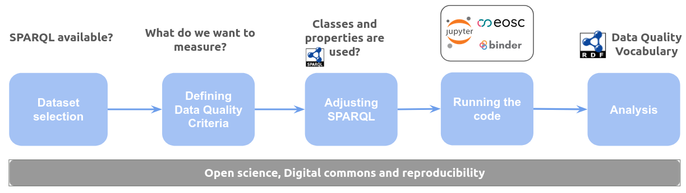

# lod-quality-reproducible
This project provides a tool based on Jupyter Notebooks to assess the quality of Linked Open Data datasets made available by the GLAM (Galleries, Libraries, Archives and Museums). 

In order to assess a wide diversity of datasets in terms of location and language, the following LOD datasets were assessed:

- Biblioteca Nacional de España - https://datos.bne.es
- Bibliothèque Nationale de France - https://data.bnf.fr
- Biblioteca Nacional del Congreso Nacional de Chile - https://datos.bcn.cl/es/endpoint-sparql
- Database of Chinese Rare Books - https://lod-cloud.net/dataset/ASCDC-CRB
- Getty Research Institute - Provenance Index - https://data.getty.edu/provenance
- LetterSampo Correspondence - http://ldf.fi/corresp/sparql

### How to cite

Gustavo Candela, Dişli, M., Dobreva, M., & Chambers, S. (2025). hibernator11/lod-quality-reproducible: V1 (Versión V1). Zenodo. https://doi.org/10.5281/zenodo.17609252
 

### Installation guide
The code can be run on cloud services such as [Binder](https://mybinder.org/) without the need to install additional software and using only the web browser by clicking on the link provided at the beginning of this documentation.

The code can be also installed in a computer by following these steps:
- download the code from GitHub
- open the folder with the code
- run the command: pip install -r requirements.txt
- open Jupyter (or Anaconda)
- open the notebook provided: lod-quality-glam-reproducible.ipynb

The code can also be run in cloud services such as the [European Open Science Cloud (EOSC)](https://open-science-cloud.ec.europa.eu/services/interactive-notebooks).

In order to assess new datasets is required to create a new configuration file following as example the ones provided in the folder [data](/data). Then, all the SPARQL queries can be reviewed in order to check their suitability for the dataset. In a similar way, the data quality criteria provided can be extended by enhancing the configuration file and including the new criteria. There is an additional notebook to illustrate how the code works demonstrating how to generate and reuse the results for different purposes. The following picutre illustrates the process.

### Licence
 Content is licensed under a <a rel="license" href="http://creativecommons.org/licenses/by/4.0/">Creative Commons Attribution 4.0 International license</a>.

Please, note that the datasets used in this project have separate licences.

### References
- Gustavo Candela: An automatic data quality approach to assess semantic data from cultural heritage institutions. J. Assoc. Inf. Sci. Technol. 74(7): 866-878 (2023). https://doi.org/10.1002/asi.24761
- Gustavo Candela, Sally Chambers, Tim Sherratt: An approach to assess the quality of Jupyter projects published by GLAM institutions. J. Assoc. Inf. Sci. Technol. 74(13): 1550-1564 (2023). https://doi.org/10.1002/asi.24835
- Candela, G. (2023). Towards a semantic approach in GLAM Labs: The case of the Data Foundry at the National Library of Scotland. Journal of Information Science, 0(0). https://doi.org/10.1177/01655515231174386
- Mahendra Mahey, Aisha Al-Abdulla, Sarah Ames, Paula Bray, Gustavo Candela, Caleb Derven, Milena Dobreva-McPherson, Katrine Gasser, Sally Chambers, Stefan Karner, Kristy Kokegei, Ditte Laursen, Abigail Potter, Armin Straube, Sophie-Carolin Wagner, and Lotte Wilms. 2019. Open a GLAM lab. International GLAM Labs Community, Book Sprint, Doha, Qatar. 164 pages. https://doi.org/10.21428/16ac48ec.f54af6ae
- Gustavo Candela, Nele Gabriëls, Sally Chambers, Milena Dobreva, Sarah Ames, Meghan Ferriter, Neil Fitzgerald, Victor Harbo, Katrine Hofmann, Olga Holownia, Alba Irollo, Mahendra Mahey, Eileen Manchester, Thuy-An Pham, Abigail Potter, and Ellen Van Keer. 2023. A checklist to publish collections as data in GLAM institutions. Global Knowledge, Memory and Communication (Nov. 2023). https://doi.org/10.1108/gkmc-06-2023-0195
